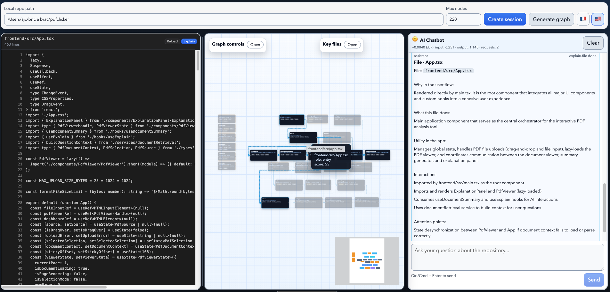

# RepoWatcher



Assistant local d'exploration de dépôt (FR/EN): cartographier un repo, visualiser les interactions entre fichiers, identifier les zones sensibles, et obtenir des explications IA contextualisées.

Local repository exploration assistant (FR/EN): map a repo, visualize file interactions, identify sensitive areas, and get contextual AI explanations.

## Objectif principal

Le but de RepoWatcher est de **réduire le temps de compréhension d'une codebase** (onboarding, audit, investigation technique) grâce à:

- un graphe interactif orienté architecture et flux applicatif,
- un assistant de chat outillé (lecture/listing/recherche/commandes contrôlées),
- des explications ciblées fichier par fichier.

The goal of RepoWatcher is to **reduce codebase understanding time** (onboarding, audit, technical investigation) with:

- an architecture and user-flow oriented interactive graph,
- a tool-enabled chat assistant (read/list/search/safe commands),
- targeted file-by-file explanations.

---

## Sommaire

1. [Ce que fait RepoWatcher](#ce-que-fait-repowatcher)
2. [Stack technique](#stack-technique)
3. [Architecture du dépôt](#architecture-du-dépôt)
4. [Comment ça fonctionne](#comment-ça-fonctionne)
5. [Prérequis](#prérequis)
6. [Installation](#installation)
7. [Démarrage rapide](#démarrage-rapide)
8. [Configuration](#configuration)
9. [Mode sans IA (fallback local)](#mode-sans-ia-fallback-local)
10. [Langues supportees](#langues-supportees)
11. [Langages et types de fichiers pris en charge](#langages-et-types-de-fichiers-pris-en-charge)
12. [Utilisation](#utilisation)
13. [API HTTP](#api-http)
14. [Sécurité et garde-fous](#sécurité-et-garde-fous)
15. [Développement et qualité](#développement-et-qualité)
16. [Dépannage](#dépannage)
17. [Limites actuelles](#limites-actuelles)
18. [Licence](#licence)

---

## Ce que fait RepoWatcher

### Fonctionnalités principales

- Création de session sur un dépôt local.
- Construction d'un graphe de fichiers multi-langages.
- Visualisation de plusieurs types de liens:
  - `import`
  - `api`
  - `config`
  - `flow`
- Mise en avant des fichiers importants (score, risque, interactions).
- Exploration interactive:
  - sélection/survol des nœuds,
  - survol/clic des liens,
  - focus visuel des relations,
  - panneau d'insight contextuel.
- Chat assistant:
  - mode manuel (`/help`, `/list`, `/read`, `/search`, `/run`),
  - mode agent LLM (si variables LLM configurées),
  - streaming NDJSON.
- Explication d'un fichier dans le flow de l'application.
- Résumé initial IA du repo: points forts, points faibles, urgences d'amélioration, points d'attention, alertes de sécurité, fichiers suspects.
- Tour IA step-by-step: succession de fichiers utilisée par un utilisateur quand il arrive et utilise l'app.
- Graphe hiérarchique: fichiers connectés en pyramide + fichiers orphelins séparés en colonne gauche.
- Chat sans débordement horizontal (retour à la ligne forcé dans les messages).
- Patch supervisé avec prévisualisation diff et vérification de hash.

### Language / Langue

- L'UI permet de choisir la langue utilisateur: `fr` ou `en`.
- The UI lets users choose their language: `fr` or `en`.
- Les endpoints chat/synthèse/explain acceptent `lang: "fr" | "en"` pour forcer la langue de sortie.
- Chat/overview/explain endpoints accept `lang: "fr" | "en"` to force output language.

### Cas d'usage typiques

- Onboarding d'un nouveau développeur.
- Cartographie rapide avant refactor.
- Audit de risques techniques.
- Investigation de régression.
- Préparation d'une revue d'architecture.

---

## Stack technique

### Runtime & langage

- **Node.js** (ESM)
- **TypeScript**

### Backend

- **Fastify** (`apps/api`)
- **Zod** pour validation de payloads

### Frontend (servi statiquement)

- **React** + **React Flow** (chargés via CDN)
- Assets UI: `apps/api/ui/index.html`, `app.js`, `app.css`

### IA

- Client **LLM compatible Chat Completions**
- Support de providers tiers via `LLM_BASE_URL`

### Outils qualité

- **Vitest** (tests)
- **TypeScript typecheck**

---

## Architecture du dépôt

```text
RepoWatcher/
├── apps/
│   ├── api/
│   │   ├── src/
│   │   │   ├── server.ts              # API Fastify, sessions, endpoints principaux
│   │   │   ├── repo-graph.ts          # Construction graphe (nodes/edges/summary)
│   │   │   ├── repo-intelligence.ts   # Repo overview + file explain (heuristique + LLM)
│   │   │   ├── agent-orchestrator.ts  # Agent outillé (list/read/search/run)
│   │   │   ├── manual-commands.ts     # Commandes slash manuelles
│   │   │   ├── llm-client.ts          # Client LLM compatible Chat Completions
│   │   │   ├── patch-utils.ts         # Diff preview + hash
│   │   │   └── web-ui.ts              # Service des assets UI
│   │   ├── test/server.test.ts
│   │   └── ui/                        # Interface graphe + chat
│   └── worker/
│       └── src/worker.ts              # Scaffold worker (placeholder)
├── packages/
│   └── core/
│       └── src/
│           ├── local-repository.ts    # Listing, lecture, recherche (rg fallback natif)
│           ├── command-policy.ts      # Allowlist commandes + exécution sécurisée
│           └── path-guard.ts          # Protection anti path traversal
├── package.json                       # Workspaces npm
└── tsconfig.base.json
```

---

## Comment ça fonctionne

### 1) Session

`POST /api/sessions` enregistre une session en mémoire (`Map`) avec:

- `id`
- `repoPath`
- `createdAt`

### 2) Graphe

`POST /api/sessions/:sessionId/repo_graph`:

- scanne les fichiers supportés,
- calcule nœuds + liens (`import`, `api`, `config`, `flow`),
- retourne un `summary` (key files, risk files, counts).

### 3) Intelligence dépôt

- `repo_overview`: synthèse globale du repo.
- `explain_file`: explication ciblée d'un fichier.

Les deux endpoints fonctionnent:

- en mode heuristique (sans LLM),
- ou enrichis par LLM (si configuré).

### 4) Chat

- `chat`: réponse complète en une fois.
- `chat/stream`: flux NDJSON (`meta`, `delta`, `done`, `error`).
  - En mode agent, les `delta` proviennent du streaming SSE du provider LLM (quand disponible).
  - En mode manuel/sans LLM, la réponse est envoyée en un seul `delta`.

### 5) Édition supervisée

`apply_patch` permet:

- preview de changement,
- vérification `expectedOldHash`,
- application explicite (`apply: true`).

---

## Prérequis

- **Node.js 20+**
- **npm 10+**
- (Optionnel) **ripgrep** (`rg`) pour accélérer la recherche texte

---

## Installation

```bash
npm install
```

---

## Démarrage rapide

### 1. Lancer l'API

```bash
npm run --workspace @repo-watcher/api dev
```

Par défaut:

- Host: `127.0.0.1`
- Port: `8787`
- UI: `http://127.0.0.1:8787/`

### 2. Créer une session

Depuis l'UI:

- saisir un chemin local de repo,
- cliquer `Créer session`,
- générer/explorer le graphe.

### 3. Optionnel: lancer le worker (scaffold)

```bash
npm run --workspace @repo-watcher/worker dev
```

---

## Configuration

### Variables d'environnement API

| Variable | Requis | Défaut | Description |
|---|---|---|---|
| `HOST` | non | `127.0.0.1` | Host Fastify |
| `PORT` | non | `8787` | Port Fastify |
| `REPO_WATCHER_PATCH_TOKEN` | non | - | Token optionnel pour protéger `POST /apply_patch` (header `x-repo-watcher-token` ou `Authorization: Bearer <token>`) |

### Variables d'environnement LLM (mode agent)

| Variable | Requis | Défaut | Description |
|---|---|---|---|
| `LLM_API_KEY` | oui (mode agent) | - | Clé API du provider |
| `LLM_MODEL` | oui (mode agent) | - | Nom du modèle |
| `LLM_BASE_URL` | oui (mode agent) | - | Endpoint compatible Chat Completions |
| `LLM_TIMEOUT_MS` | non | `30000` | Timeout en ms |

Exemple:

```bash
export LLM_API_KEY="<secret>"
export LLM_MODEL="<model-name>"
export LLM_BASE_URL="<chat-completions-endpoint>"
export LLM_TIMEOUT_MS="30000"
npm run --workspace @repo-watcher/api dev
```

---

## Mode sans IA (fallback local)

Si les variables `LLM_API_KEY`, `LLM_MODEL` et `LLM_BASE_URL` ne sont pas définies:

- aucun appel LLM externe n'est effectué,
- le chat reste disponible en mode manuel (`/help`, `/list`, `/read`, `/search`, `/run`),
- un message non slash dans le chat renvoie explicitement que le mode LLM n'est pas configuré,
- `repo_overview` fonctionne en mode `heuristic`,
- `explain_file` fonctionne en mode `heuristic`,
- les compteurs de tokens/coût de session restent à `0`.

Ce mode permet d'utiliser RepoWatcher entièrement en local pour la cartographie, la navigation et les explications heuristiques.

---

## Langues supportees

- UI: `fr` ou `en` (sélecteur en barre supérieure).
- API: le champ `lang` accepte `fr` ou `en` sur les endpoints chat/graphe/overview/explain.
- Valeur par défaut API: `fr` (si `lang` absent).
- Les réponses heuristiques respectent la langue demandée.
- En mode LLM, la langue demandée est aussi imposée dans les prompts de génération.

---

## Langages et types de fichiers pris en charge

### Fichiers source indexés dans le graphe

Le graphe indexe les fichiers source suivants:

- JavaScript/TypeScript: `.ts`, `.tsx`, `.js`, `.jsx`, `.mjs`, `.cjs`
- Python: `.py`
- JVM: `.java`, `.kt`, `.kts`, `.scala`, `.groovy`
- Go: `.go`
- Rust: `.rs`
- .NET: `.cs`, `.fs`, `.vb`
- C/C++/Obj-C: `.c`, `.cc`, `.cpp`, `.cxx`, `.h`, `.hh`, `.hpp`, `.hxx`, `.m`, `.mm`
- Scripts: `.php`, `.rb`, `.lua`, `.pl`, `.pm`, `.sh`, `.bash`, `.zsh`
- Mobile: `.swift`, `.dart`
- Langages fonctionnels: `.ex`, `.exs`, `.erl`, `.hrl`, `.hs`, `.ml`, `.mli`, `.clj`, `.cljs`
- Data/numérique: `.r`, `.jl`

### Fichiers de configuration intégrés au graphe

RepoWatcher inclut aussi des fichiers de configuration (par nom exact, extension, et heuristique de chemin), par exemple:

- extensions: `.json`, `.jsonc`, `.yaml`, `.yml`, `.toml`, `.ini`, `.cfg`, `.conf`, `.properties`, `.env`, `.xml`
- fichiers connus: `package.json`, `tsconfig.json`, `go.mod`, `pom.xml`, `build.gradle(.kts)`, `application.yml`, `appsettings.json`, `docker-compose.yml`, `pyproject.toml`, `requirements.txt`, `.env*`, `vite/webpack/rollup/tailwind/postcss config`, etc.

### Exclusions (listing/recherche locale)

Pour éviter le bruit, certains dossiers/fichiers sont ignorés (`node_modules`, `dist`, `build`, `.next`, `.nuxt`, `.svelte-kit`, `coverage`, caches Python, etc.) ainsi que plusieurs suffixes binaires/media (`.png`, `.jpg`, `.pdf`, `.zip`, `.dll`, `.so`, ...).

---

## Utilisation

### Flux recommandé

1. Ouvrir l'UI.
2. Créer une session sur un repo local.
3. Générer le graphe (`repo_graph`).
4. Naviguer via nœuds/liens pour comprendre le flow.
5. Utiliser `repo_overview` pour une vue macro.
6. Cliquer un fichier puis `explain_file` pour le détail.
7. Utiliser le chat pour des questions ciblées ou commandes outillées.

### Commandes manuelles du chat

- `/help`
- `/list [path]`
- `/read <path>`
- `/search <query>`
- `/run <commande>`

---

## API HTTP

### Santé

- `GET /health`

Réponse:

```json
{ "status": "ok" }
```

### Sessions

- `POST /api/sessions`

Payload:

```json
{ "repoPath": "/abs/path/to/repo" }
```

### Chat

- `POST /api/sessions/:sessionId/chat`
- `POST /api/sessions/:sessionId/chat/stream`

Payload:

```json
{ "message": "explique l'architecture", "lang": "fr" }
```

### Lecture fichier

- `POST /api/sessions/:sessionId/file/read`

Payload:

```json
{ "path": "apps/api/src/server.ts" }
```

### Patch supervisé

- `POST /api/sessions/:sessionId/apply_patch`

Payload:

```json
{
  "path": "apps/api/src/server.ts",
  "newContent": "...",
  "expectedOldHash": "<sha256 optional>",
  "apply": false
}
```

### Graphe

- `POST /api/sessions/:sessionId/repo_graph`

Payload:

```json
{ "rootPath": ".", "maxNodes": 180, "lang": "fr" }
```

### Overview dépôt

- `POST /api/sessions/:sessionId/repo_overview`

Payload:

```json
{ "rootPath": ".", "maxNodes": 180, "lang": "fr" }
```

### Explication fichier

- `POST /api/sessions/:sessionId/explain_file`

Payload:

```json
{
  "path": "apps/api/src/server.ts",
  "rootPath": ".",
  "maxNodes": 220,
  "trailPaths": [],
  "lang": "fr"
}
```

`lang` peut être `"fr"` ou `"en"` sur:

- `POST /api/sessions/:sessionId/chat`
- `POST /api/sessions/:sessionId/chat/stream`
- `POST /api/sessions/:sessionId/repo_graph`
- `POST /api/sessions/:sessionId/repo_overview`
- `POST /api/sessions/:sessionId/explain_file`

---

## Sécurité et garde-fous

### Accès filesystem

- Toutes les résolutions de chemin passent par `resolveInsideRoot`.
- Protection explicite contre path traversal (`..`, chemins hors racine).

### Exécution commandes (`/run`)

- Politique **deny-by-default** (allowlist stricte).
- Exemples autorisés:
  - `ls -la`
  - `ls -la | grep -E <pattern>`
  - `npm test`, `npm run lint`, `npm run build`
  - `cat <relative_file>`
  - `head -n <1..500> <relative_file>`
  - `tail -n <1..500> <relative_file>`
  - pipelines de lecture bornés (2-3 segments)
- Sous Windows: sous-ensemble contrôlé `cmd /c` et `powershell Get-Content`.

### Robustesse LLM

- L'agent doit répondre en JSON structuré (`action` ou `final`).
- Boucle bornée (`MAX_TOOL_STEPS = 12`) pour éviter dérives.

---

## Développement et qualité

### Scripts racine

```bash
npm run typecheck
npm run test
npm run lint
npm run build
```

### Scripts workspace API

```bash
npm run --workspace @repo-watcher/api dev
npm run --workspace @repo-watcher/api test
npm run --workspace @repo-watcher/api build
```

### Scripts workspace Core

```bash
npm run --workspace @repo-watcher/core test
npm run --workspace @repo-watcher/core build
```

---

## Dépannage

### L'UI ne charge pas

- Vérifier `GET /` et `GET /ui/app.js`.
- Vérifier que `apps/api/ui` existe bien.

### "Mode LLM non configuré"

- Définir `LLM_API_KEY`, `LLM_MODEL`, `LLM_BASE_URL`.
- Vérifier que l'endpoint expose une API compatible `/chat/completions`.

### Session invalide

- Une session est stockée en mémoire du process API.
- Redémarrer l'API invalide les sessions existantes.

### Recherche lente

- Installer `ripgrep` (`rg`) pour améliorer `search`.

---

## Limites actuelles

- Sessions non persistées (mémoire process).
- Worker encore au stade scaffold.
- Certaines relations (`flow`, `api`, `config`) sont heuristiques.
- UI frontend servie en statique (pas de pipeline build frontend dédié).
- Le streaming dépend des capacités du provider configuré sur `LLM_BASE_URL` (fallback non-stream si indisponible).

---

## Licence

MIT — voir [LICENSE](./LICENSE).
